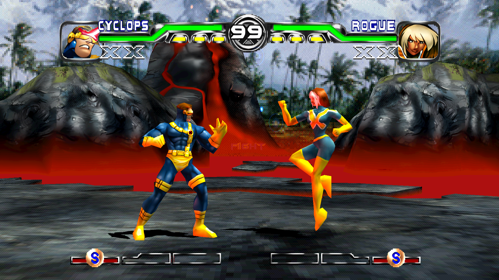
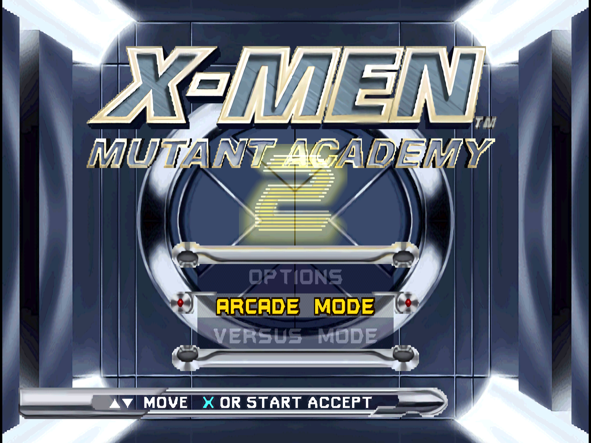
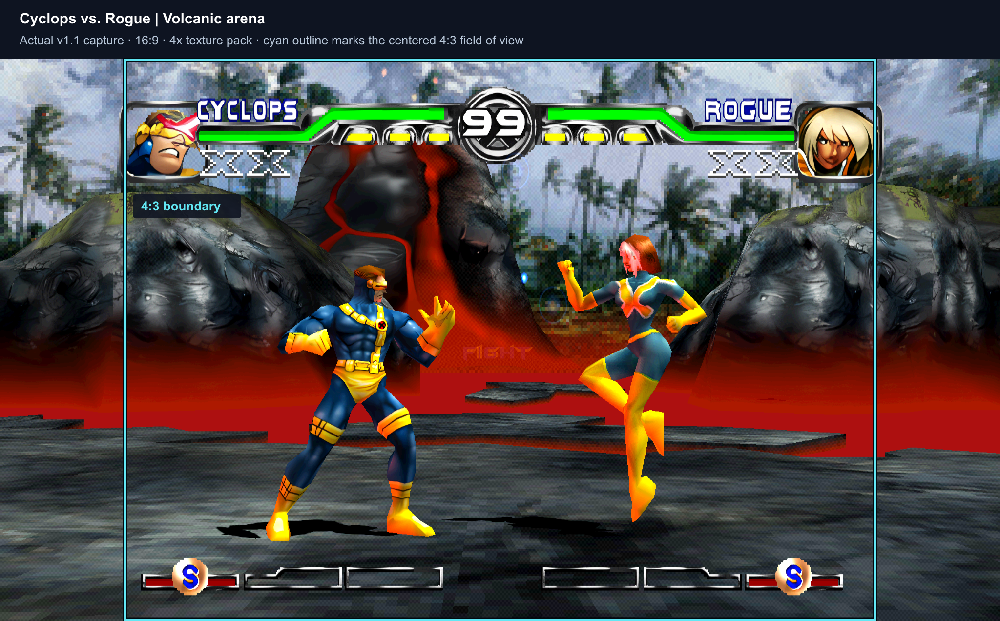
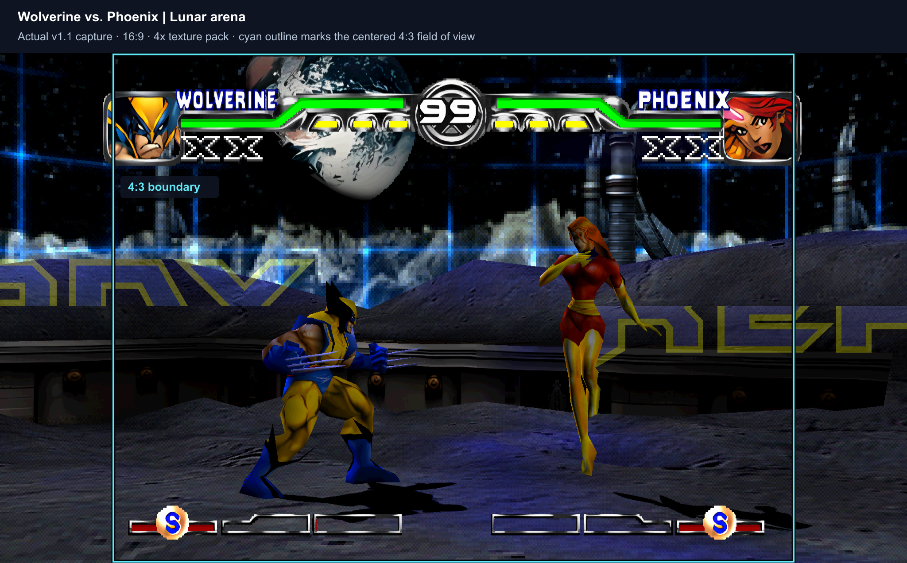
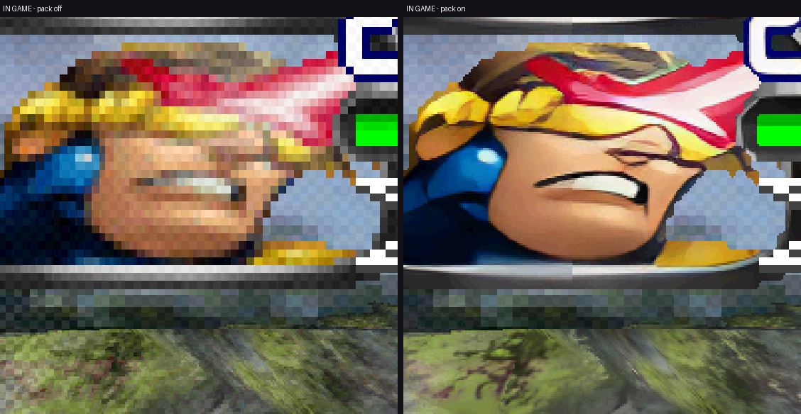
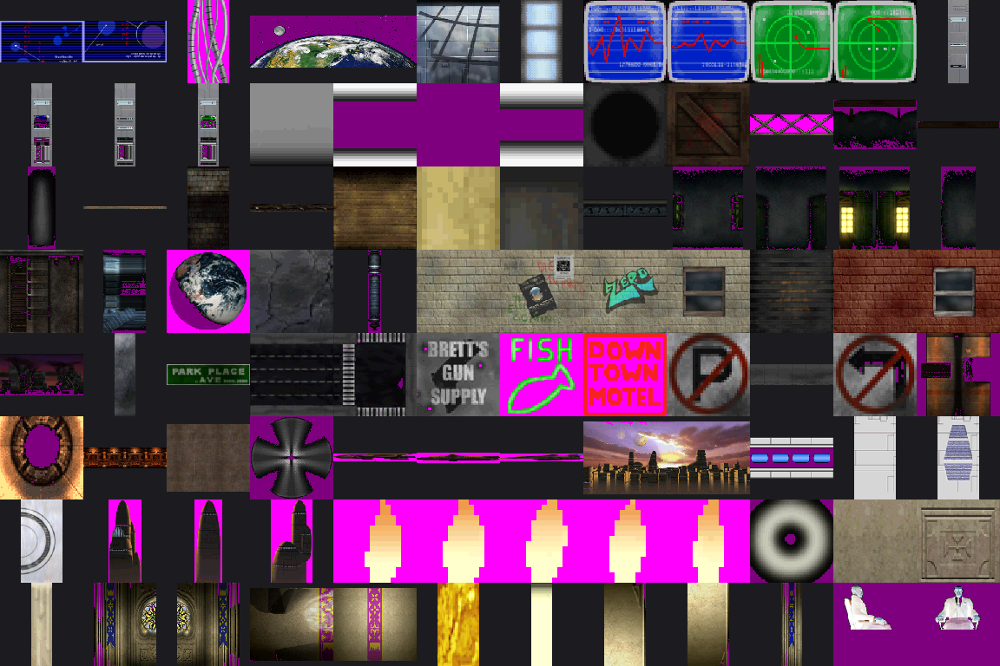
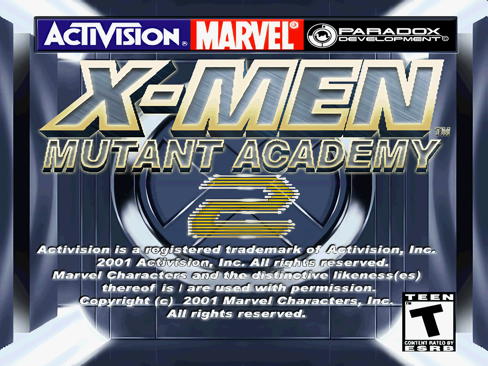

# X-Men: Mutant Academy 2 — PC port

A static recompilation of the PlayStation game *X-Men: Mutant Academy 2* (SLUS-01382),
built with [RecompOne](https://github.com/BlackLabelHQ/RecompOne). The PS1 executable and
its eighteen character overlays are translated to C# ahead of time and linked against
RecompOne's runtime, so this is a native program rather than an emulator: the game's own
code runs directly, and the hardware it expects — GPU, SPU, CD drive, controllers — is
provided by the runtime.

It runs end to end at 60 fps, rasterising internally at 4x, with an optional 4x texture
pack built from the game's own art and optional 16:9 output.

## Download v1.1

[Download the Windows x64 release, including the 4x texture pack](https://github.com/GTTeancum/xmen-mutant-academy-2-pc/releases/tag/v1.1).
Unzip into a writable folder and supply your own USA disc (SLUS-01382): CUE/BIN
with all 13 tracks, or CHD passed as `XMenMA2.exe "D:\roms\game.chd"`.
No disc image is included. See the bundled `README.txt` for installation and controls.

v1.1 adds **16:9 widescreen support** and **one final texture replacement for the splash screen**.



*16:9, internal 4x, texture pack on.*



*The front end has no 3D in it, so it stays 4:3 whatever the setting.*

## What this repository is

The port itself: the entry point, the patches, the build configuration, and the tooling
written for it. It deliberately does **not** contain the game.

Kept outside source control:

| | why |
|---|---|
| the disc image (`*.bin`, `*.cue`) | the game |
| `port/generated/` | recompiled game code, derived from the disc |
| `port/assets/` | textures decoded out of the disc |
| `port/packs/` | the upscaled pack built from those textures |
| `tools/RecompOne/`, `tools/esrgan/` | third-party, vendored locally |

For the release download, supply your own disc image; the executable and pack are
already built. To build from source, run the recompiler and build the pack using the
scripts below.

## Status

**Works.** Boots to the title, plays through arcade mode, 60 fps. FMV, XA audio, memory
cards, the character-select and options screens, and all eighteen characters load. The
published build is a single self-contained `XMenMA2.exe`.

Since the first release: optional 16:9 that widens the view rather than stretching it,
the splash and other full-screen art brought into the upscale pack, and **F12** for a
screenshot of exactly what is on screen.

**Unverified.** Nobody has confirmed the audio actually sounds right — the developer
setup for this port has no audio output. Two-player input is wired but only port A has
been driven. Endings, credits and practice mode have never been reached. Round timing
has not been compared against hardware.

**Known rough edges** are listed in [TO_DO.md](TO_DO.md), which is kept honest rather
than tidy — including the things that were tried and did not work.

## Widescreen

Off by default; **Settings > Display > Widescreen (16:9)** turns it on, and resizes the
window to match, because a 16:9 frame left inside a 4:3 window gets boxed a second time
and reads as a fault.





*Actual v1.1 captures: Cyclops versus Rogue in the volcanic arena, and Wolverine
versus Phoenix in the lunar arena. The cyan outline marks the centered 4:3 field
of view inside each 16:9 capture; scenery outside it is the additional widescreen
view. These are boundary overlays, not separately rendered 4:3 frames. The original
captures are available [here](docs/gameplay.png) and [here](docs/gameplay-wolverine.png).*

[Capture method and validation](docs/captures-v1.1.md).

The game culls anything that projects outside its own screen, so widening the area the
renderer draws into achieves nothing — the scenery is dropped before the GPU sees it.
Instead the perspective projection is squeezed by a quarter, which puts a 16:9 field of
view inside the 4:3 screen the game believes in; its own culling then keeps all of it,
and the frame is stretched back out at presentation. The stages are one and a half to
three screens wide, so there is plenty there to show.

Frames with no 3D in them — the movies, the front end, the VS card — are left at 4:3 and
pillarboxed, never stretched.

The HUD is flat artwork at fixed screen positions, so it would come out a third wide.
Nothing in the GPU stream separates it from the stage — same primitives, one ordering
table, shared palettes — so the separation comes from the game's own code: a sprite table
at `0x800E30D8` holding every 2D element it draws. Primitives assembled in there are
squeezed to match, and come out the shape they were drawn.

Press **F12** at any time for a screenshot of exactly what is on screen.

## The texture pack

The interesting part, and the part that took the longest to get right.



*Same frame, same script, pack off and on, at 1:1 output pixels.*

Textures are read **from the disc**, not captured from a play session. `DATA/WAD.WAD` is
a `PWF ` archive holding 1,891 TIM images; every one of them exists whether or not
anyone has visited the screen that draws it, which is what makes coverage a property of
the disc rather than of how thoroughly you played.



Two things had to be solved to make that usable.

**A texture is what the game uploaded, not the page it landed in.** The resolver used to
identify a texture by a fixed 256-texel window around the tile being drawn. This game
packs several images into the same VRAM rows, so that window is a slab of unrelated
neighbours, all decoded with one depth and one palette — most of every "texture" was
garbage. `VramTracker` now records the rectangle of each image the CPU DMAs into VRAM,
and a tile is identified by the upload that contains it. An image load is the only event
in the GPU command set that says *these pixels are one picture*.

**A palette changes on its way into VRAM.** Every entry gets bit 15 set, and the magenta
colour key `0x7C1F` becomes `0x0000`. The first rule decides the lookup key; the second
decides whether a sprite has transparency or a magenta blob. Verified against every
palette the running game was observed to upload — 102 of 102 exact.

`tools/vramhash.py` reimplements the runtime's lookup hash so a texture decoded offline
carries the same key the game computes at draw time, and `tools/verify_textures.py`
checks every image is a correct decode before it ships.

### Building the pack

```bash
cd port
python tools/disc.py extract disc                                     # ISO 9660 out of the disc image
python tools/extract_textures.py --wad disc/DATA/WAD.WAD --out assets/disc-textures
python tools/verify_textures.py --dir assets/disc-textures/textures --out assets/report
python tools/upscale_textures.py --dump assets --out packs/xmenma2-4x --only tiles
```

Full-screen pictures are collected from a run rather than from the disc, since they are
keyed by the pixels the game uploads: play with `XMENMA2_DUMP=images`, then
`upscale_textures.py --only images` puts them in the same pack.

Anything without a replacement falls back to the original, so a partial pack is always
safe, and deleting a file from the pack simply restores that texture.

## Tools

| tool | what it does |
|---|---|
| `disc.py` | reads the ISO 9660 filesystem out of a MODE2/2352 disc image |
| `wad.py` | reads `DATA/WAD.WAD`, the game's asset archive |
| `tim.py` | finds and decodes TIM images, and models the palette upload |
| `vramhash.py` | reproduces the runtime's texture lookup hash |
| `extract_textures.py` | disc to PNGs, named by the key the runtime looks them up by |
| `merge_textures.py` | combines disc textures with textures observed at run time |
| `verify_textures.py` | rejects bad decodes, flags what is not a picture |
| `restore_alpha.py` | puts correct transparency back on a texture upscaled elsewhere |
| `upscale_textures.py` | builds the 4x pack |
| `wide_check.py` | tells the end of an arena apart from a renderer clipping it |
| `closure.py`, `fixmaps.py`, `mipsdis.py` | recompilation support |

Diagnostics live in `port/patches/`: `Diag.cs` (logging, watchdog, crash capture),
`Capture.cs` (headless screenshots and scripted input), `TextureDump.cs`, and
`Harness.cs` (RAM and scratchpad snapshots, pokes, watches, and a write probe that
names the game code writing a range of memory).

## The splash screen



*Actual v1.1 capture with the bundled splash replacement enabled.*

Not a texture. It and 87 other full-screen images — the whole concept-art gallery — are
512x480 8bpp pictures decoded straight into the framebuffer, so they never pass through
the texture path at all. Format: 18-byte header, 768-byte BGR palette, pixels at 784,
rows bottom-up. `port/assets/fullscreen/` holds them once extracted.

They are upscaled now, by the same 4x pipeline as the textures. They do not arrive as
pictures — the game uploads one row at a time, 480 separate transfers for a splash — so
the rows are reassembled, hashed by their pixels, and a matching image in the pack is
written over that part of video memory at full internal resolution. Nothing changes when
the pack has no match.

Only the splash is in the pack so far. The other 87 need visiting once with
`XMENMA2_DUMP=images` to collect them, and then the same upscale.

## Legal

The source repository excludes the disc, generated game code, and texture pack. *X-Men: Mutant Academy 2* is
© 2001 Activision and Marvel Characters, Inc. The screenshots are of the game running.
You need your own copy of the disc for any of this to do anything.
